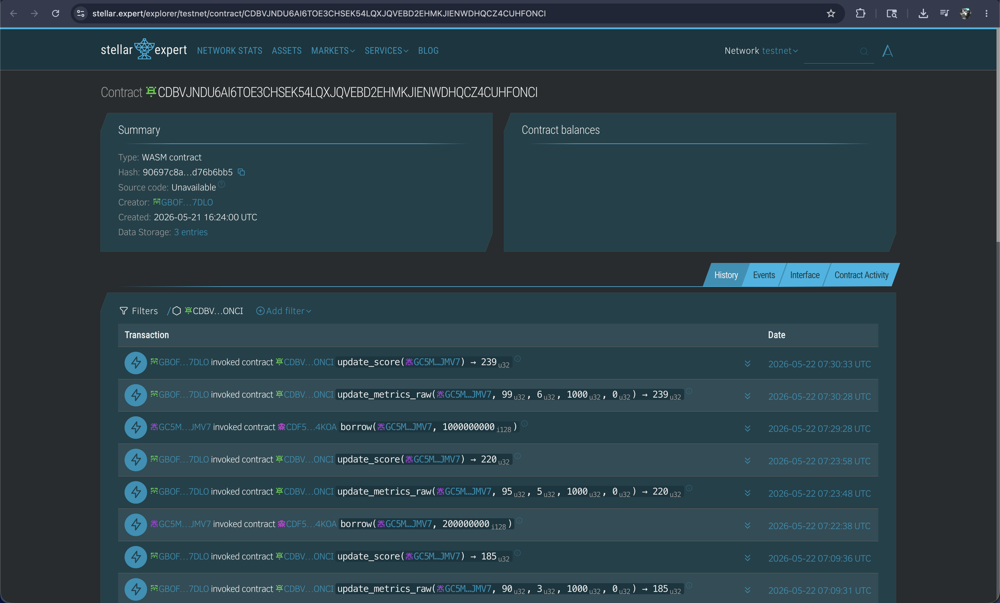
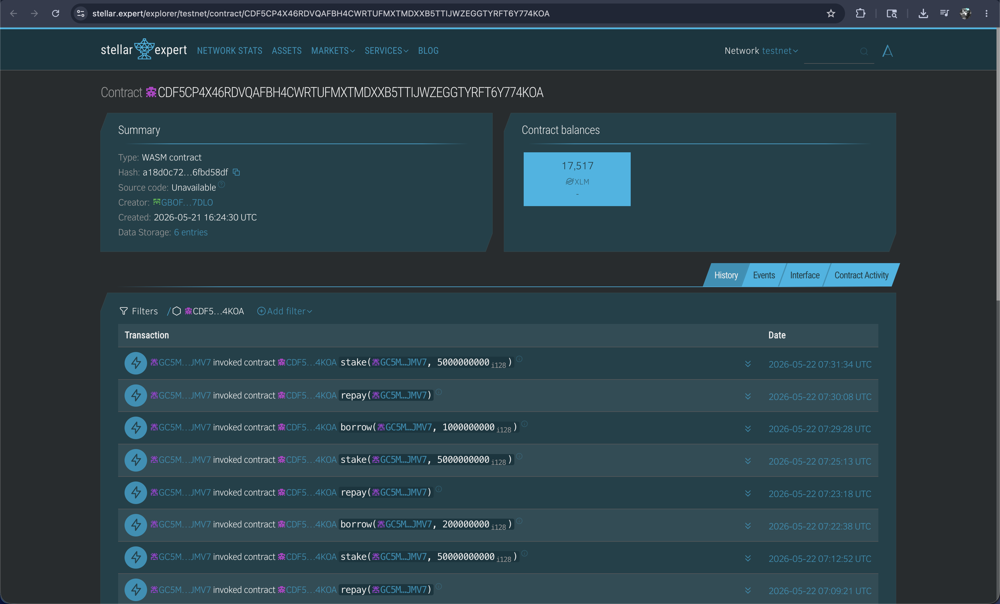
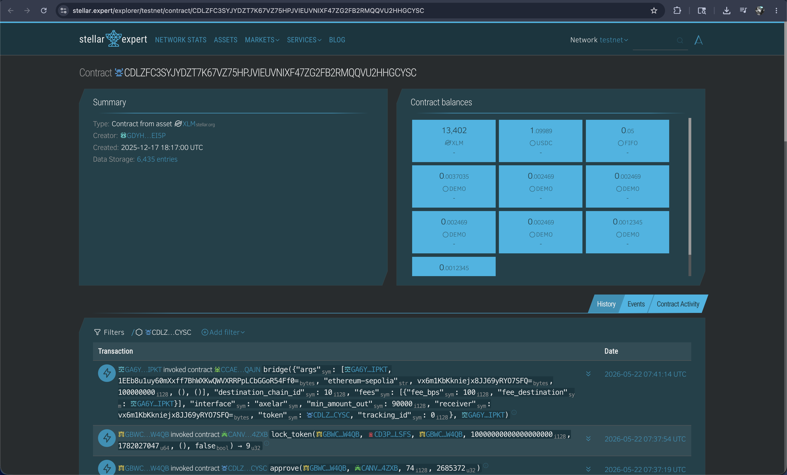

# Kredito

Transparent on-chain credit scores and instant micro-loans for the Filipino unbanked, built on Stellar and accessed through Freighter.

## Links

🔗 **[Live Demo → kredito-iota.vercel.app](https://kredito-iota.vercel.app)**

🔭 **[Credit Registry on Stellar Expert](https://stellar.expert/explorer/testnet/contract/CDP3FEVG46ZUH73VZLDFQWHZHEIHITM3FVG26ZR4I3RY34HSWVNWHVPZ?filter=interface)**

🔭 **[Lending Pool on Stellar Expert](https://stellar.expert/explorer/testnet/contract/CDRE2MZVSHOWEITL7UBBTNIHRH6IC5USDKY5K5AFELPJZ7VMEV5LQVWH?filter=interface)**

🔭 **[PHPC Token on Stellar Expert](https://stellar.expert/explorer/testnet/contract/CD2GKG5HM5FMFCN4OMPXKTBHC23N2EFIQGESQV46WJGZAD76FP7SLPJR?filter=interface)**

> **SEA Stellar Hackathon · Track: Payments & Financial Access**

## Problem

Small retail business owners in the Philippines (sari-sari stores, online resellers, market vendors) lack traditional credit history, making them "invisible" to banks. They often rely on informal lenders with predatory interest rates or use personal savings, which stunts their growth. Traditional digital wallets have low transaction caps and no path to credit, leaving SMEs without the capital needed for bulk inventory orders.

## Solution

Kredito uses deterministic on-chain transaction history to generate verifiable credit scores. These scores are stored in a Soroban smart contract and used to unlock tiered micro-loans from a decentralized liquidity pool. Settlement happens in seconds with near-zero fees, and users build a portable "Credit Passport" with every on-time repayment.

## Product Flow

1. **Connect Wallet** — Sign in with Freighter through a wallet-signed Stellar WebAuth challenge.
2. **Review Credit Passport** — See raw metrics, the exact formula, and your on-chain tier.
3. **Borrow Instantly** — Pool disburses PHPC to your wallet via smart contract.
4. **Repay & Level Up** — Repayment pulls PHPC from that same connected wallet, then updates your score live. Higher tier = bigger limit.

## Current Demo Note

Repayment requires the wallet to hold `principal + fee`.

Example:

- borrow `500 PHPC`
- fee `25 PHPC`
- total repayment due `525 PHPC`

Because the wallet receives only the borrowed principal, you must top up the extra fee amount before repayment. If you do not, the PHPC token contract rejects repayment with `InsufficientBalance`.

## Architecture

- **Frontend (Next.js 16)**: Built with React 19, Zustand for state management, and TanStack Query for data fetching.
- **Backend (Express)**: Handles wallet-auth sessions, score orchestration, fee sponsorship, and wallet identity records in SQLite.
- **Stellar (Soroban)**: Core financial logic running on the Stellar Testnet.
- **Client SDK**: `@stellar/stellar-sdk` for transaction building, fee-sponsoring, and RPC interaction.

## Project Structure

```text
kredito/
├── contracts/
│   ├── credit_registry/        # Scoring, tiering, and metrics logic
│   ├── lending_pool/           # Borrowing, repayment, and pool management
│   └── phpc_token/             # SEP-41 compliant PHPC stablecoin
├── backend/
│   ├── src/
│   │   ├── routes/             # Auth, Credit, and Loan API endpoints
│   │   ├── stellar/            # Fee-bump and RPC utilities
│   │   └── scoring/            # Off-chain score calculation logic
├── frontend/
│   ├── app/                    # Next.js App Router (Dashboard, Borrow, Repay)
│   ├── store/                  # Zustand auth and UI state
│   └── lib/                    # API clients and Freighter integration
└── docs/                       # Architecture, Setup, and API specs
```

## Stellar Features Used

| Feature                    | Usage                                                                |
| :------------------------- | :------------------------------------------------------------------- |
| **Soroban Contracts**      | Powering the scoring engine and the lending pool logic.              |
| **PHPC (Stablecoin)**      | Enabling non-volatile loans pegged to the local currency (PHP).      |
| **Sponsored Transactions** | Issuer-funded fee-bumps for a seamless, gasless user experience.     |
| **Stellar RPC**            | Real-time indexing of on-chain activity to calculate credit metrics. |

## Smart Contracts

Deployed and verified on Stellar testnet:

- **`credit_registry`**: `CDP3FEVG46ZUH73VZLDFQWHZHEIHITM3FVG26ZR4I3RY34HSWVNWHVPZ`
- **`lending_pool`**: `CDRE2MZVSHOWEITL7UBBTNIHRH6IC5USDKY5K5AFELPJZ7VMEV5LQVWH`
- **`phpc_token`**: `CD2GKG5HM5FMFCN4OMPXKTBHC23N2EFIQGESQV46WJGZAD76FP7SLPJR`

Explorer Link: https://stellar.expert/explorer/testnet/contract/CDP3FEVG46ZUH73VZLDFQWHZHEIHITM3FVG26ZR4I3RY34HSWVNWHVPZ?filter=interface


Explorer Link: https://stellar.expert/explorer/testnet/contract/CDRE2MZVSHOWEITL7UBBTNIHRH6IC5USDKY5K5AFELPJZ7VMEV5LQVWH?filter=interface


Explorer Link: https://stellar.expert/explorer/testnet/contract/CD2GKG5HM5FMFCN4OMPXKTBHC23N2EFIQGESQV46WJGZAD76FP7SLPJR?filter=interface


## Contract Functions

| Function         | Contract          | Description                                          |
| :--------------- | :---------------- | :--------------------------------------------------- |
| `update_metrics` | `credit_registry` | Submits raw tx/balance metrics to update score.      |
| `get_tier`       | `credit_registry` | Returns the current user tier (0-3).                 |
| `borrow`         | `lending_pool`    | Validates tier/limit and disburses PHPC to borrower. |
| `repay`          | `lending_pool`    | Accepts repayment and triggers score improvement.    |
| `deposit`        | `lending_pool`    | Allows admins/liquidity providers to fund the pool.  |

## Setup & Installation

### Prerequisites

- Node.js 20+ and `pnpm`
- Rust (latest stable) and `stellar-cli`
- Freighter browser extension (set to Testnet)

### Smart Contracts

```bash
cd contracts
cargo test --workspace
stellar contract build
```

### Backend

```bash
cd backend
pnpm install
pnpm build
pnpm dev
```

_Requires `backend/.env` with `JWT_SECRET`, `ENCRYPTION_KEY`, `ISSUER_SECRET_KEY`, `WEB_AUTH_SECRET_KEY` (or reuse the issuer key), `HOME_DOMAIN`, `WEB_AUTH_DOMAIN`, and the deployed Stellar contract IDs._

### Frontend

```bash
cd frontend
pnpm install
pnpm lint
pnpm exec next build --webpack
pnpm dev
```

_Runs at `http://localhost:3000`. Freighter should be installed and pointed at Stellar Testnet._

## Documentation

- [DEMO.md](./DEMO.md): presenter runbook and dashboard E2E demo flow
- [docs/SETUP.md](./docs/SETUP.md): local setup
- [docs/TESTING.md](./docs/TESTING.md): live E2E testing steps
- [docs/ARCHITECTURE.md](./docs/ARCHITECTURE.md): system architecture

## Why Stellar?

Stellar provides the perfect infrastructure for micro-finance:

- **Sub-cent Fees**: Loans are economically viable even at small amounts.
- **Instant Settlement**: Borrowers get funds in 3-5 seconds, not days.
- **Native Compliance**: Stablecoins like PHPC allow for regulatory-friendly settlement in local currency.
