# Kredito

Transparent on-chain credit scores and instant micro-loans for the Filipino unbanked, built on Stellar and accessed through Freighter.


## Links

🔗 **[Live Demo → kredito-iota.vercel.app](https://kredito-iota.vercel.app)**

🔭 **[Credit Registry on Stellar Expert](https://stellar.expert/explorer/testnet/contract/CAZWIQZX4OK5FCSTL4NFFWFVLPGO2IBWERLN572RNP4V4EHSWK7U3KH7?filter=interface)**

🔭 **[Lending Pool on Stellar Expert](https://stellar.expert/explorer/testnet/contract/CCBKOG6YGOTBBGXHKAIMJIFE46EXP4MTGJ3HLSBLRG54SQAMK6TRHWBP?filter=interface)**

🔭 **[XLM SAC on Stellar Expert](https://stellar.expert/explorer/testnet/contract/CDLZFC3SYJYDZT7K67VZ75HPJVIEUVNIXF47ZG2FB2RMQQVU2HHGCYSC?filter=interface)**

> **SEA Stellar Hackathon · Track: Payments & Financial Access**

---

## Problem

Small retail business owners in the Philippines (sari-sari stores, online resellers, market vendors) lack traditional credit history, making them "invisible" to banks. They often rely on informal lenders with predatory interest rates or use personal savings, which stunts their growth. Traditional digital wallets have low transaction caps and no path to credit, leaving SMEs without the capital needed for bulk inventory orders.

## Solution

Kredito uses deterministic on-chain transaction history to generate verifiable credit scores. These scores are stored in a Soroban smart contract and used to unlock tiered micro-loans from a decentralized liquidity pool. Settlement happens in seconds with near-zero fees, and users build a portable "Credit Passport" with every on-time repayment.

### The Scoring Formula

Our scoring engine is completely transparent and verifiable on-chain. Each metric is weighted to reward network presence and financial reliability:

`score = (tx_count × 2) + (repayment_count × 10) + (xlm_balance_factor × 5) − (default_count × 25)`

## Product Flow

1. **Connect Wallet** — Sign in with Freighter through a wallet-signed Stellar WebAuth (SEP-10) challenge.
2. **Review Credit Passport** — See raw metrics, the exact scoring formula, and your on-chain tier.
3. **Borrow Instantly** — Pool disburses XLM to your wallet via smart contract.
4. **Repay & Level Up** — Repayment pulls XLM from that same connected wallet, then updates your score live. Higher tier = bigger limit.

---

## ✅ Submission Checklist

| Requirement                        | Status                                                        |
| :--------------------------------- | :------------------------------------------------------------ |
| Public GitHub repository           | ✅                                                            |
| README with complete documentation | ✅                                                            |
| Minimum 8+ meaningful commits      | ✅                                                            |
| Live demo link                     | ✅ [kredito-iota.vercel.app](https://kredito-iota.vercel.app) |
| Mobile responsive view             | ✅ See screenshot below                                       |
| CI/CD pipeline running             | ✅ See badge & screenshot below                               |
| Inter-contract calls working       | ✅ See section below                                          |
| XLM SAC integrated                 | ✅ Native XLM (`CDLZFC3S...`)                                 |
| Pool deployed                      | ✅ Lending Pool (`CCBKOG6Y...`)                               |
| Contract addresses                 | ✅ See section below                                          |

---

## 🖼️ User Flow

A complete walkthrough of the Kredito experience — from landing to repayment.

---

### Step 1 — Landing Page

The homepage introduces Kredito and invites the user to connect their Stellar wallet via Freighter. No account creation needed.

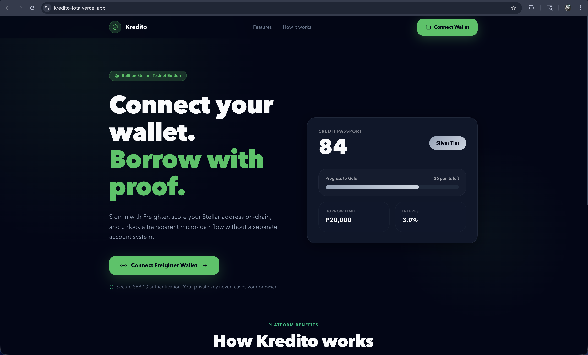

---

### Step 2 — Freighter Wallet Authentication

Clicking **Connect Freighter Wallet** triggers a SEP-10 WebAuth challenge popup. The user confirms the transaction in Freighter — their private key never leaves the browser.

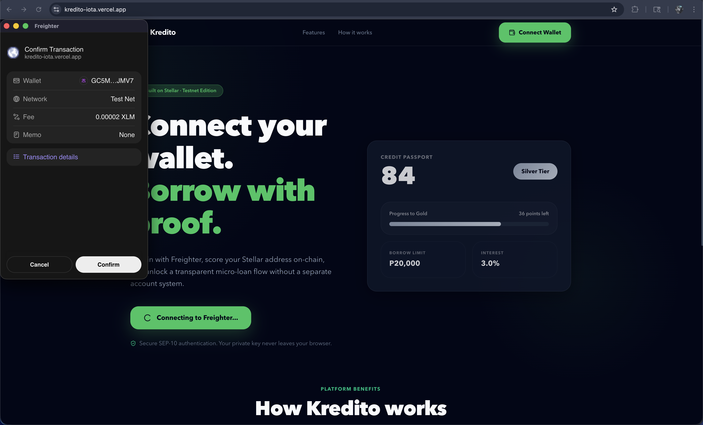

---

### Step 3 — Credit Passport Dashboard

After authentication, the user sees their **Credit Passport**: on-chain score (82), Silver tier, borrow limit (◎20,000), fee rate (3%), transaction count, repayments, and the full transparent scoring formula with raw metrics.

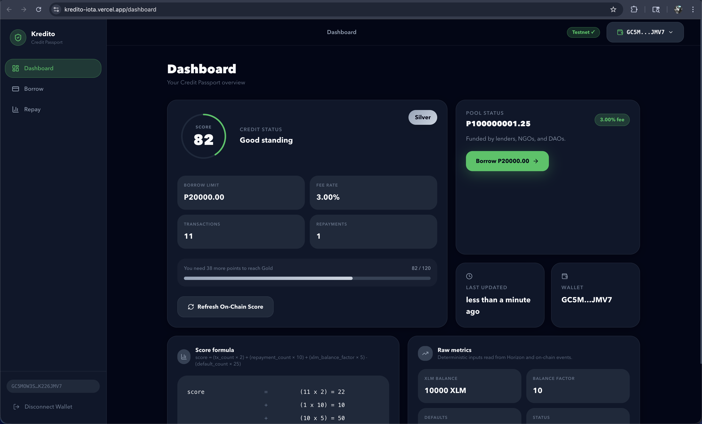

---

### Step 4 — Borrow: Loan Review

The user navigates to **Borrow** and enters a loan amount. The UI shows tier eligibility, fee breakdown, 30-day term, and the total repayment due — all enforced by the on-chain Credit Passport.

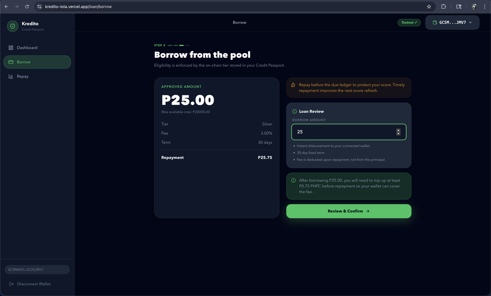

---

### Step 5 — Borrow: Freighter Signing

The user confirms the loan. Freighter opens to sign the borrow transaction. The lending pool validates their tier via `credit_registry::get_tier`, then disburses XLM via the native SAC contract.

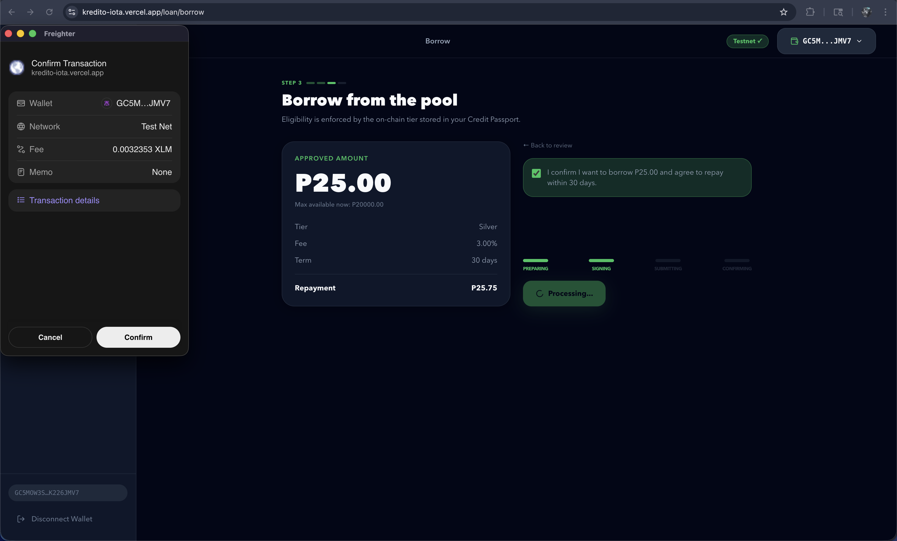
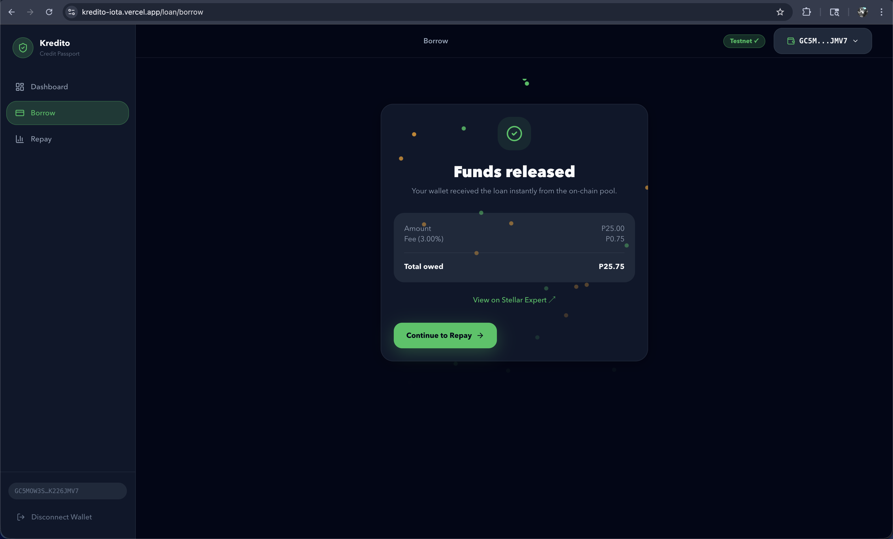

---

### Step 6 — Repay: Active Loan

The **Repay** page displays the active loan — principal (◎25.00), fee owed (◎0.75), total due (◎25.75), wallet XLM balance, due date, and days remaining.

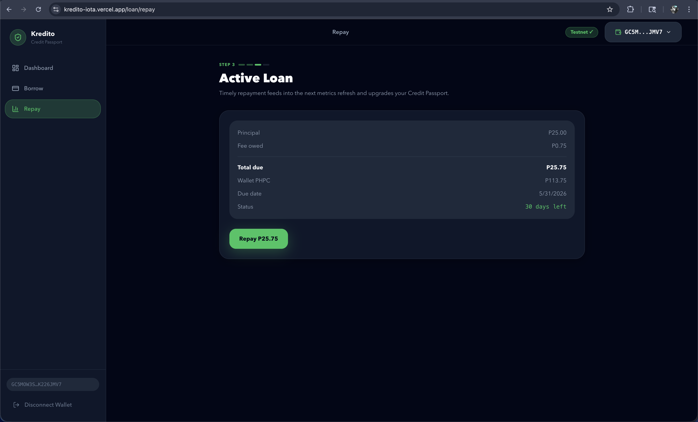

---

### Step 7 — Repay: Freighter Signing

Clicking **Repay ◎25.75** triggers a Freighter popup to sign the repayment. The contract calls `xlm_token::transfer_from` to collect funds, then `credit_registry::update_metrics` to update the score on-chain.

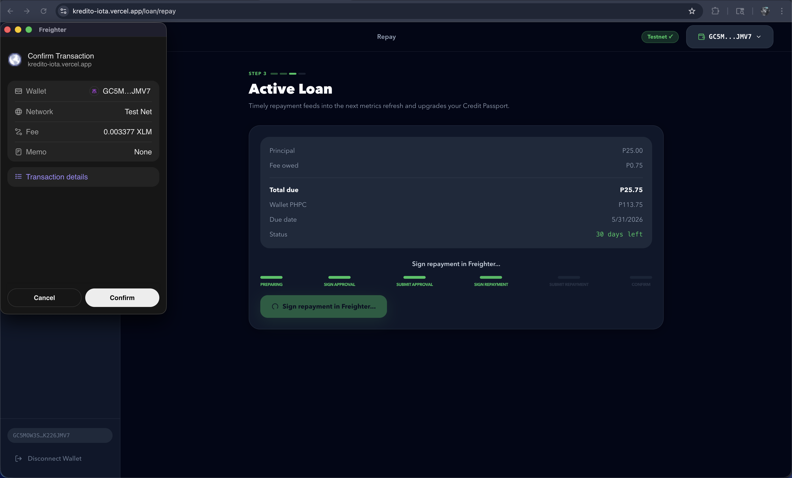

---

### Step 8 — Repaid on Time & Score Update

Repayment is confirmed. The Credit Passport score updates live from **82 → 88**. Each on-time repayment builds toward a higher tier and a larger borrow limit.

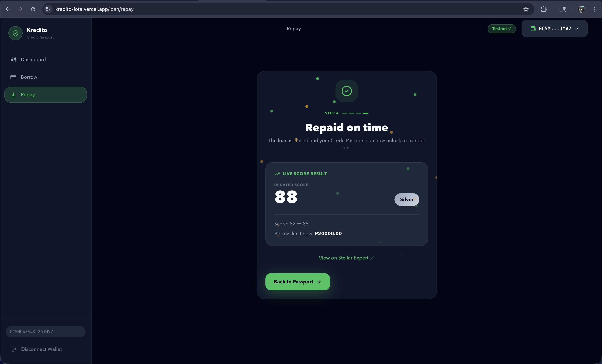

---

## 📱 Mobile Responsive

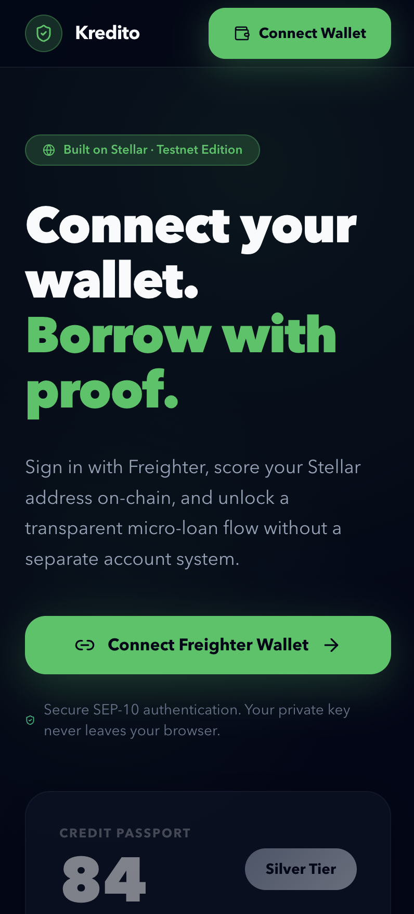

The frontend is built with Tailwind CSS and Next.js App Router, with responsive layouts across all screens: landing page, dashboard, borrow flow, and repay flow.

---

## 🔄 CI/CD Pipeline

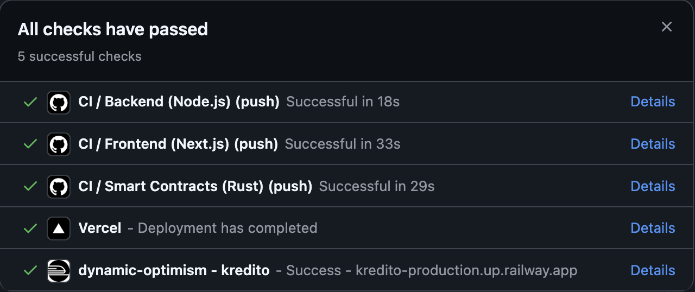

All checks pass on every push to `main`:

- **Backend** (Node.js) — lint + build
- **Frontend** (Next.js) — lint + build
- **Smart Contracts** (Rust) — cargo test
- **Vercel** — auto-deploy on merge
- **Railway** — runs after every other CI check is done and passed

---

## 🔗 Inter-Contract Calls

Kredito implements **inter-contract calls** between the core Soroban contracts and the Stellar Asset Contract (SAC):

### Call Graph

```
Frontend / Backend
      │
      ▼
lending_pool::borrow(borrower, amount)
      │
      ├──► credit_registry::get_tier(borrower)             ← reads tier eligibility
      │
      └──► xlm_sac::transfer(pool, borrower, amt)          ← disburses funds

lending_pool::repay(borrower, amount)
      │
      ├──► xlm_sac::transfer_from(borrower, pool)          ← collects repayment
      │
      └──► credit_registry::update_metrics(borrower)       ← updates score on-chain
```

### Example Transaction Hash (Inter-Contract Call)

Borrow + Repay transactions:
https://stellar.expert/explorer/testnet/contract/CCBKOG6YGOTBBGXHKAIMJIFE46EXP4MTGJ3HLSBLRG54SQAMK6TRHWBP

Sample Borrow Transaction:
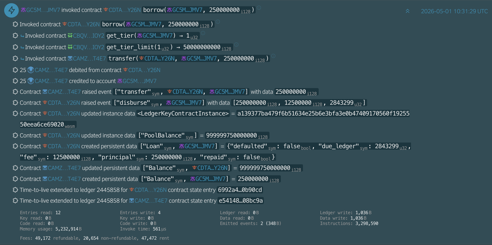

Sample Repay Transaction:
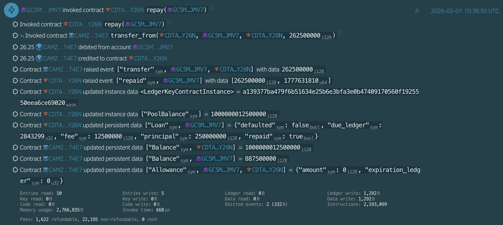

---

## 🪙 Asset & Pool

### Native XLM (Stellar Asset Contract)

Kredito uses native XLM via the **Stellar Asset Contract (SAC)** as the loan currency. This ensures high liquidity and native integration with the Stellar ecosystem.

| Property         | Value                                                                                                                                                |
| :--------------- | :--------------------------------------------------------------------------------------------------------------------------------------------------- |
| Contract Address | `CDLZFC3SYJYDZT7K67VZ75HPJVIEUVNIXF47ZG2FB2RMQQVU2HHGCYSC`                                                                                           |
| Standard         | SEP-41 (Stellar token interface)                                                                                                                     |
| Explorer         | [View on Stellar Expert](https://stellar.expert/explorer/testnet/contract/CDLZFC3SYJYDZT7K67VZ75HPJVIEUVNIXF47ZG2FB2RMQQVU2HHGCYSC?filter=interface) |

### Lending Pool

A decentralized liquidity pool that manages loan disbursements and repayments.

| Property         | Value                                                                                                                                                |
| :--------------- | :--------------------------------------------------------------------------------------------------------------------------------------------------- |
| Contract Address | `CCBKOG6YGOTBBGXHKAIMJIFE46EXP4MTGJ3HLSBLRG54SQAMK6TRHWBP`                                                                                           |
| Pool Capacity    | ◎100,000,000 XLM                                                                                                                                     |
| Explorer         | [View on Stellar Expert](https://stellar.expert/explorer/testnet/contract/CCBKOG6YGOTBBGXHKAIMJIFE46EXP4MTGJ3HLSBLRG54SQAMK6TRHWBP?filter=interface) |

---

## Smart Contracts

The contracts are deployed and verified on **Stellar Testnet**:

| Contract          | Address                                                    |
| :---------------- | :--------------------------------------------------------- |
| `credit_registry` | `CAZWIQZX4OK5FCSTL4NFFWFVLPGO2IBWERLN572RNP4V4EHSWK7U3KH7` |
| `lending_pool`    | `CCBKOG6YGOTBBGXHKAIMJIFE46EXP4MTGJ3HLSBLRG54SQAMK6TRHWBP` |

Explorer Link: https://stellar.expert/explorer/testnet/contract/CAZWIQZX4OK5FCSTL4NFFWFVLPGO2IBWERLN572RNP4V4EHSWK7U3KH7?filter=interface


Explorer Link: https://stellar.expert/explorer/testnet/contract/CCBKOG6YGOTBBGXHKAIMJIFE46EXP4MTGJ3HLSBLRG54SQAMK6TRHWBP?filter=interface


---

## Contract Functions

| Function         | Contract          | Description                                                                                  |
| :--------------- | :---------------- | :------------------------------------------------------------------------------------------- |
| `update_metrics` | `credit_registry` | Submits raw tx/balance metrics to update score.                                              |
| `get_tier`       | `credit_registry` | Returns the current user tier (0–4).                                                         |
| `borrow`         | `lending_pool`    | Validates tier/limit and disburses XLM to borrower. Calls `credit_registry` and `xlm_sac`.   |
| `repay`          | `lending_pool`    | Accepts repayment, triggers score improvement. Calls `xlm_sac` and `credit_registry`.        |
| `stake`          | `lending_pool`    | Allows users to stake XLM into the pool and earn rewards from fees.                          |
| `time_deposit`   | `lending_pool`    | Allows users to lock XLM for a fixed term and earn guaranteed interest.                      |

---

## Architecture

- **Frontend (Next.js 15)**: Built with React 19, Zustand for state management, and TanStack Query for data fetching.
- **Backend (Express)**: Handles wallet-auth sessions, score orchestration, fee sponsorship, and fully stateless operation with the chain as the source of truth.
- **Stellar (Soroban)**: Core financial logic running on Stellar Testnet with inter-contract calls to the native SAC.
- **Client SDK**: `@stellar/stellar-sdk` for transaction building, fee-sponsoring, and RPC interaction.

## Project Structure

```text
kredito/
├── contracts/
│   ├── credit_registry/        # Scoring, tiering, and metrics logic
│   └── lending_pool/           # Borrowing, repayment, pool management + inter-contract calls
├── backend/
│   ├── src/
│   │   ├── routes/             # Auth, Credit, and Loan API endpoints
│   │   ├── stellar/            # Fee-bump and RPC utilities
│   │   └── scoring/            # Off-chain score calculation logic
├── frontend/
│   ├── app/                    # Next.js App Router (Dashboard, Borrow, Repay, Staking, Deposit)
│   ├── store/                  # Zustand auth and UI state
│   └── lib/                    # API clients and Freighter integration
└── docs/                       # Architecture, Setup, and API specs
```

## Stellar Features Used

| Feature                    | Usage                                                                     |
| :------------------------- | :------------------------------------------------------------------------ |
| **Soroban Contracts**      | Powering the scoring engine and the lending pool logic.                   |
| **Inter-Contract Calls**   | `lending_pool` calls `credit_registry` and `xlm_sac` during borrow/repay. |
| **Native XLM (SAC)**       | Using native assets with Soroban smart contracts via the SAC bridge.      |
| **Sponsored Transactions** | Issuer-funded fee-bumps for a seamless, gasless user experience.          |
| **Stellar RPC**            | Real-time indexing of on-chain activity to calculate credit metrics.      |
| **SEP-10 WebAuth**         | Secure, keyless wallet authentication via Freighter.                      |

---

## Current Demo Note

Repayment requires the wallet to hold `principal + fee`.

Example:

- borrow `100 XLM`
- fee `5 XLM` (500 bps)
- total repayment due `105 XLM`

Because the wallet receives only the borrowed principal, you must have enough XLM to cover the fee before repayment.

### 💡 Demo Tip: Getting Testnet XLM

If your wallet is empty or you need extra XLM to cover the interest for repayment, you can use the Stellar laboratory to fund your account via Friendbot:

https://laboratory.stellar.org/#account-creator?network=testnet

---

## 🛠️ Setup & Installation

### Prerequisites

Ensure you have the following installed on your machine:

- **Node.js 20+** and **pnpm** (for frontend and backend)
- **Rust** (latest stable) and **stellar-cli** (for smart contracts)
- **Freighter Browser Extension** (set to **Testnet**)

---

### 🚀 Quick Start (Local Development)

1. **Clone & Initialize**: Run the setup script to install all dependencies and create `.env` files from examples.

   ```bash
   ./scripts/setup.sh
   ```

2. **Configure Environment**: Update `backend/.env` and `frontend/.env` with your specific keys and contract IDs (if not using the defaults).

3. **Start the Backend**:

   ```bash
   cd backend
   pnpm dev
   ```

4. **Start the Frontend**:
   ```bash
   cd frontend
   pnpm dev
   ```
   The app will be available at `http://localhost:3000`.

---

### 📦 Smart Contract Management

The Kredito logic lives in two Soroban contracts.

- **Build & Test**:

  ```bash
  cd contracts
  cargo test --workspace
  stellar contract build
  ```

- **Redeploy**: If you need to deploy a fresh set of contracts to Testnet:
  ```bash
  cd contracts
  ./redeploy.sh
  ```
  This script will build, deploy, and initialize the contracts, saving the new IDs to `contracts/deployed.json`.

---

### 🖥️ Backend Configuration

The backend handles off-chain scoring and fee-sponsorship.

- **Linting**: `pnpm run lint` (or `pnpm run lint --fix` to auto-fix issues).
- **Production Build**: `pnpm build` followed by `pnpm start`.

_Requires `backend/.env` (see `backend/.env.example`). Generate `ADMIN_API_SECRET` as a separate random token; do not reuse the issuer signing key in HTTP auth._

---

### 🎨 Frontend Development

Built with Next.js App Router and Tailwind CSS.

- **Linting**: `pnpm lint`.
- **Production Build**: `pnpm build` followed by `pnpm start`.

_Runs at `http://localhost:3000`. Freighter should be installed and pointed at Stellar Testnet._

---

## Documentation

- [DEMO.md](./DEMO.md): presenter runbook and dashboard E2E demo flow
- [docs/SETUP.md](./docs/SETUP.md): local setup
- [docs/TESTING.md](./docs/TESTING.md): live E2E testing steps
- [docs/ERROR_CODES.md](./docs/ERROR_CODES.md): system error codes and handling
- [docs/ARCHITECTURE.md](./docs/ARCHITECTURE.md): system architecture

## Why Stellar?

Stellar provides the perfect infrastructure for micro-finance:

- **Sub-cent Fees**: Loans are economically viable even at small amounts.
- **Instant Settlement**: Borrowers get funds in 3–5 seconds, not days.
- **Native Efficiency**: Using native XLM via SAC bridge provides a seamless experience without needing custom token management for the base pool.
- **Composable Contracts**: Inter-contract calls let the lending pool, credit registry, and token work together atomically.

---

## What's Next / Roadmap

We're building for the long term. Here's what we have planned:

- **Mainnet Launch**: Moving beyond Testnet to support real-world micro-lending with deep XLM liquidity.
- **DAO Governance**: Handing over control of tier limits, interest rates, and fee structures to a community of liquidity providers.
- **Credit SDK**: Enabling Filipino e-commerce platforms and digital wallets to integrate Kredito scores into their own checkouts.
- **Advanced Identity**: Integrating with Stellar's identity standards to allow for higher limits through optional KYC levels.

---

## 👥 Authors

Built with ❤️ by **[nazakun021](https://github.com/nazakun021)** for the Stellar Hackathon.
