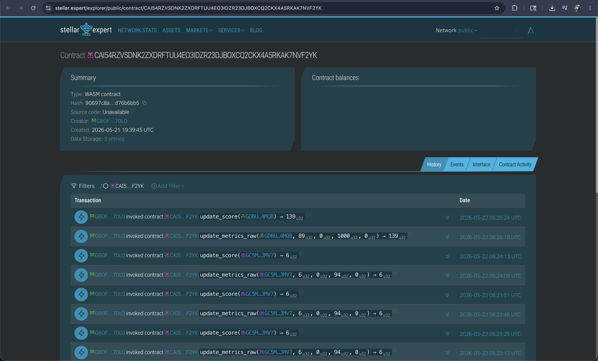
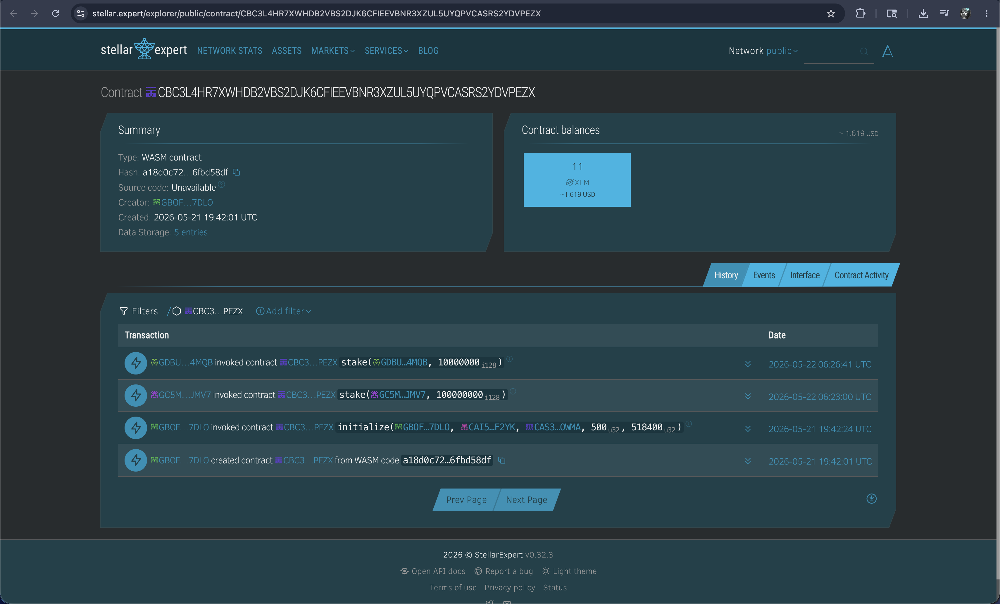
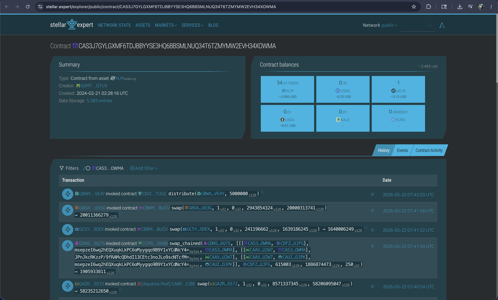

# Kredito

### On-chain Microfinance Infrastructure for Filipinos


Kredito is a Stellar-powered lending platform that enables underserved Filipinos to build portable on-chain credit scores and access transparent micro-loans with low transaction costs.

Built on Stellar + Soroban and deployed on Mainnet.

---

## Problem

Millions of Filipinos remain unbanked or underbanked.

Traditional lending systems:

- Require extensive paperwork and collateral.
- Exclude users without formal credit history.
- Impose high interest rates and predatory terms.
- Are physically and digitally inaccessible to many micro-business owners, freelancers, and first-time borrowers.

Micro-business owners, freelancers, and first-time borrowers often cannot access fair financial services despite having consistent transaction behavior and financial capability.

---

## Vision

Kredito aims to create a portable on-chain financial identity system for Southeast Asia.

By using blockchain-based credit scoring and transparent smart contracts, users can gradually build financial trust without relying on traditional banking infrastructure.

Our long-term vision is:

- **Borderless Credit Identity**: Building a global web3 reputation that can be verified anywhere.
- **Programmable Microfinance**: Smart contracts handling risk-free tiered liquid pools automatically.
- **Inclusive Lending**: Giving underserved communities and people access to credit and allowing them to grow.

---

## Purpose

We built Kredito to explore how Stellar can power real-world financial inclusion.

Instead of speculative blockchain use cases, Kredito focuses on practical financial access:

- **Credit Scoring**: High-fidelity, real-time credit scoring built on-chain.
- **Micro-loans**: Low-barrier micro-credit for essential working capital.
- **Staking Liquidity**: Enabling community-driven yield pools.
- **Transparent Pools**: Standardized rules verified on-chain, not hidden behind bank registers.
- **Low-fee Transactions**: Enabling sub-cent operations via Stellar.

---

## Target Users

- **Sari-sari Store Owners**: Small neighborhood business owners needing short-term working capital to buy bulk inventory.
- **Freelancers & Gig Workers**: Users with consistent but fluctuating income streams and limited traditional banking access.
- **First-Time Borrowers**: Young professionals or unbanked individuals without traditional credit history.
- **Everyday Filipinos**: Underbanked people seeking transparent, low-cost, and reliable alternatives to traditional lending systems.

---

## Features

- **On-Chain Credit Scoring System**: Real-time evaluation of transaction counts, repayment history, XLM balances, and defaults.
- **Three-Tier Borrower Classification**: Automatic classification into Bronze, Silver, or Gold tiers based on credit score.
- **Smart Contract Powered Lending Pool**: Fully decentralized pool managing secure loan disbursements and repayments.
- **Wallet-Based Authentication (SEP-10)**: Secure and keyless authentication via Freighter wallet challenge-response.
- **XLM-Powered Borrowing and Repayment**: Direct borrowing and repayment using native XLM as standard collateral.
- **Staking & Liquidity Participation**: Stakers can contribute XLM liquidity and earn proportional yield from borrowing fees.
- **Time Deposit Functionality**: Stakers lock XLM for defined terms to earn guaranteed interest yields.
- **KYC Onboarding Flow**: Dynamic frontend verification flow connected to the user's Credit Passport.
- **Transaction Sponsorship & Fee Bumping**: Lowers the barrier to entry by using backend fee-sponsorship for gasless operations.
- **Mainnet Deployment on Stellar**: Fully deployed and operational contracts on both Stellar Testnet and Mainnet.

---

## How It Works

Kredito connects off-chain user verification with on-chain credit score tracking and automated liquidity pools. Below is the step-by-step user journey and the underlying architecture that powers it.

### The Scoring Formula

Our credit scoring engine is completely transparent, deterministic, and verifiable on-chain. Each metric is weighted to reward network presence and financial reliability:

$$\text{Score} = (\text{tx\_count} \times 1) + (\text{repayment\_count} \times 15) + (\text{xlm\_balance\_factor} \times 5) - (\text{default\_count} \times 30)$$

_(Note: XLM balances are scaled to factor in sustained liquidity)._

### Step-by-Step User Flow

A complete walkthrough of the Kredito experience — from landing to repayment:

#### Step 1 — Landing Page

The homepage introduces Kredito and invites the user to connect their Stellar wallet via Freighter. No account creation needed.


#### Step 2 — Freighter Wallet Authentication

Clicking **Connect Freighter Wallet** triggers a SEP-10 WebAuth challenge popup. The user confirms the transaction in Freighter — their private key never leaves the browser.


#### Step 3 — Credit Passport Dashboard

After authentication, the user sees their **Credit Passport**: on-chain score (82), Silver tier, borrow limit (◎20,000), fee rate (3%), transaction count, repayments, and the full transparent scoring formula with raw metrics.


#### Step 4 — Borrow: Loan Review

The user navigates to **Borrow** and enters a loan amount. The UI shows tier eligibility, fee breakdown, 30-day term, and the total repayment due — all enforced by the on-chain Credit Passport.


#### Step 5 — Borrow: Freighter Signing

The user confirms the loan. Freighter opens to sign the borrow transaction. The lending pool validates their tier via `credit_registry::get_tier`, then disburses XLM via the native SAC contract.


#### Step 6 — Repay: Active Loan

The **Repay** page displays the active loan — principal (◎25.00), fee owed (◎0.75), total due (◎25.75), wallet XLM balance, due date, and days remaining.


#### Step 7 — Repay: Freighter Signing

Clicking **Repay ◎25.75** triggers a Freighter popup to sign the repayment. The contract calls `xlm_token::transfer_from` to collect funds, then `credit_registry::update_metrics` to update the score on-chain.


#### Step 8 — Repaid on Time & Score Update

Repayment is confirmed. The Credit Passport score updates live from **82 → 88**. Each on-time repayment builds toward a higher tier and a larger borrow limit.


### Mobile Responsive Layout

The frontend is built with Tailwind CSS and Next.js App Router, with responsive layouts across all screens:


### CI/CD Pipeline

Every commit pushed to `main` undergoes automated testing and deployment verification:

- **Backend (Node.js)** — Lint + Build checks
- **Frontend (Next.js)** — Lint + Build checks
- **Smart Contracts (Rust)** — Cargo test verification
- **Vercel** — Auto-deploy on merge
- **Railway** — Production backend deploys upon passing CI checks
  

### Inter-Contract Calls

Kredito implements robust atomic inter-contract calls between the core Soroban contracts and the Stellar Asset Contract (SAC):

#### Call Graph

```
Frontend / Backend
      │
      ▼
lending_pool::borrow(borrower, amount)
      │
      ├──► credit_registry::get_tier(borrower)             ← reads tier eligibility
      │
      └──► xlm_sac::transfer(pool, borrower, amt)          ← disburses funds

lending_pool::repay(borrower, amount)
      │
      ├──► xlm_sac::transfer_from(borrower, pool)          ← collects repayment
      │
      └──► credit_registry::update_metrics(borrower)       ← updates score on-chain
```

#### Example Transaction Verification (Inter-Contract Call)

Borrow & Repay transaction history:
https://stellar.expert/explorer/testnet/contract/CDF5CP4X46RDVQAFBH4CWRTUFMXTMDXXB5TTIJWZEGGTYRFT6Y774KOA

Sample Borrow Transaction:


Sample Repay Transaction:


### Soroban Smart Contract Functions

| Function         | Contract          | Description                                                                                |
| :--------------- | :---------------- | :----------------------------------------------------------------------------------------- |
| `update_metrics` | `credit_registry` | Submits raw tx/balance metrics to update score.                                            |
| `get_tier`       | `credit_registry` | Returns the current user tier (0–4).                                                       |
| `borrow`         | `lending_pool`    | Validates tier/limit and disburses XLM to borrower. Calls `credit_registry` and `xlm_sac`. |
| `repay`          | `lending_pool`    | Accepts repayment, triggers score improvement. Calls `xlm_sac` and `credit_registry`.      |
| `stake`          | `lending_pool`    | Allows users to stake XLM into the pool and earn rewards from fees.                        |
| `time_deposit`   | `lending_pool`    | Allows users to lock XLM for a fixed term and earn guaranteed interest.                    |

### Repayment Fee Mechanics & Demo Tip

Repayment requires the wallet to hold `principal + fee` (e.g., 500 bps = 5% baseline fee for Bronze).
For example, if you borrow `◎100 XLM` on Bronze:

- **Principal borrowed**: `◎100 XLM`
- **Lending fee (5%)**: `◎5 XLM`
- **Total due for repayment**: `◎105 XLM`

_Tip for Demoing:_ If your wallet needs extra XLM to cover the repayment fee, use the [Stellar Laboratory Friendbot](https://laboratory.stellar.org/#account-creator?network=testnet) to fund your account instantly.

---

## Tech Stack

- **Frontend**: Next.js 15, React 19, Tailwind CSS, Zustand, TanStack Query
- **Backend**: Node.js, Express.js (deployed on Railway)
- **Blockchain**: Stellar (Soroban / Horizon API / Stellar SDK), SEP-10 Authentication
- **Smart Contracts**: Rust, `soroban-sdk`
- **Infrastructure & Tools**: Vercel, GitHub Actions, Freighter Wallet

---

## How to Run Locally

### Prerequisites

- **Node.js 20+** and **pnpm**
- **Rust** (latest stable) and **stellar-cli**
- **Freighter Browser Extension** (pointed to **Testnet** or **Mainnet**)

### Steps

1. **Clone & Initialize**:
   ```bash
   git clone https://github.com/nazakun021/kredito.git
   cd kredito
   ./scripts/setup.sh
   ```
2. **Configure Environment**: Update `backend/.env` and `frontend/.env` with your specific keys and contract IDs.
3. **Start the Backend**:
   ```bash
   cd backend
   pnpm dev
   ```
4. **Start the Frontend**:
   ```bash
   cd frontend
   pnpm dev
   ```
   The app will be available at `http://localhost:3000`.

---

## Deployment

### Testnet

- **Credit Registry Address**: `CDBVJNDU6AI6TOE3CHSEK54LQXJQVEBD2EHMKJIENWDHQCZ4CUHFONCI`
- **Lending Pool Address**: `CDF5CP4X46RDVQAFBH4CWRTUFMXTMDXXB5TTIJWZEGGTYRFT6Y774KOA`
- **Native XLM SAC Address**: `CDLZFC3SYJYDZT7K67VZ75HPJVIEUVNIXF47ZG2FB2RMQQVU2HHGCYSC`
- **📸 Screenshot - Stellar Expert (Testnet)**:
  
  
  

### Mainnet

- **Credit Registry Address**: `CAI54RZVSDNK2ZXDRFTUU4EO3IDZR23DJBOXCQ2CKX4A5RKAK7NVF2YK`
- **Lending Pool Address**: `CBC3L4HR7XWHDB2VBS2DJK6CFIEEVBNR3XZUL5UYQPVCASRS2YDVPEZX`
- **Native XLM SAC Address**: `CAS3J7GYLGXMF6TDJBBYYSE3HQ6BBSMLNUQ34T6TZMYMW2EVH34XOWMA`
- **Screenshot - Stellar Expert (Mainnet)**:
  
  
  

---

## Demo

- **Live App**: [kredito-iota.vercel.app](https://kredito-iota.vercel.app)
- **Demo Video**: [Demo Video Link](https://drive.google.com/drive/folders/1kTvBjHh4-7i3uG4Ou6SnLws0RxHNDjtL?usp=sharing)
- **Pitch Deck**: [Pitch Deck Link](https://docs.google.com/presentation/d/1Rs2iGc_Or35qvZvAA3H8LElbu6GsNQ5rwXffzSAXQP8/edit?usp=sharing)

---

## Team

| Name                    | Role                 | GitHub                                       |
| :---------------------- | :------------------- | :------------------------------------------- |
| **Tirso Benedict Naza** | Full-stack Developer | [@nazakun021](https://github.com/nazakun021) |

---

## License

MIT
